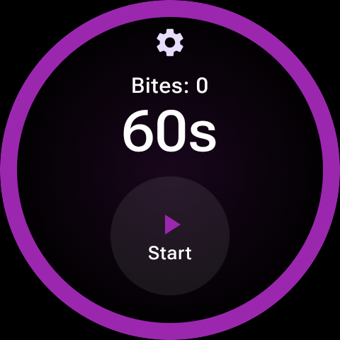
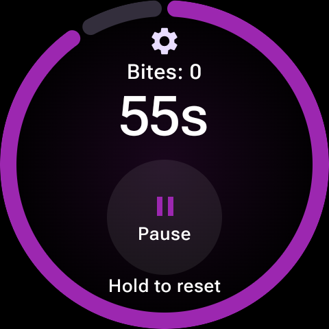
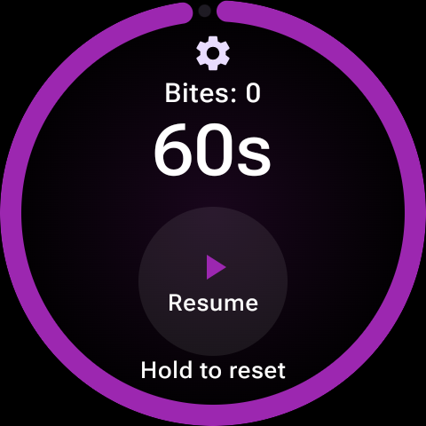
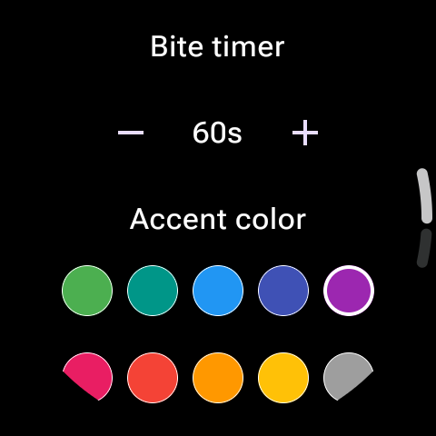
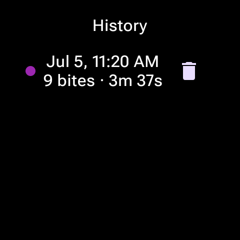
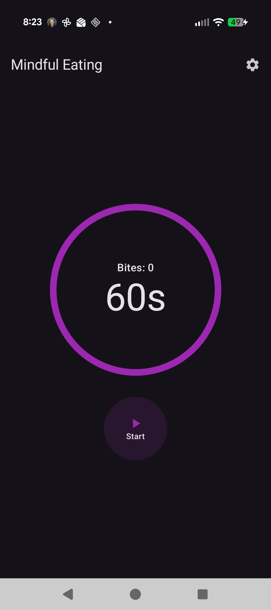
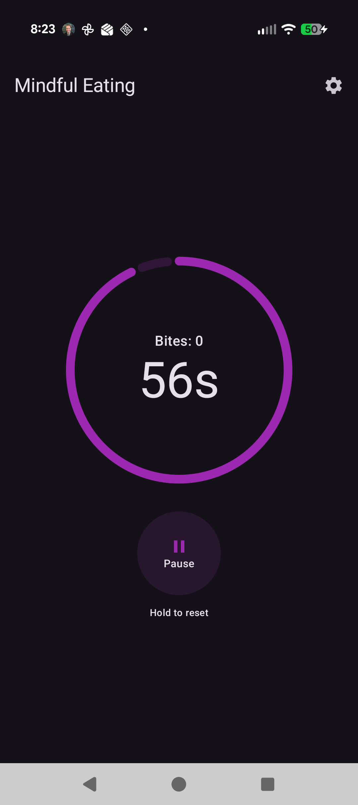
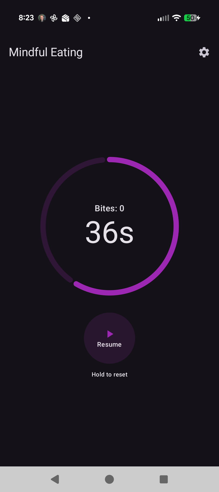
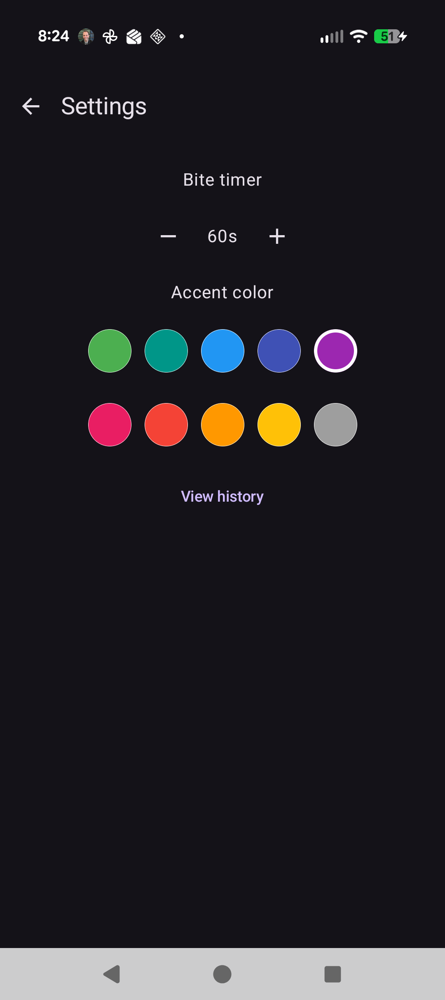
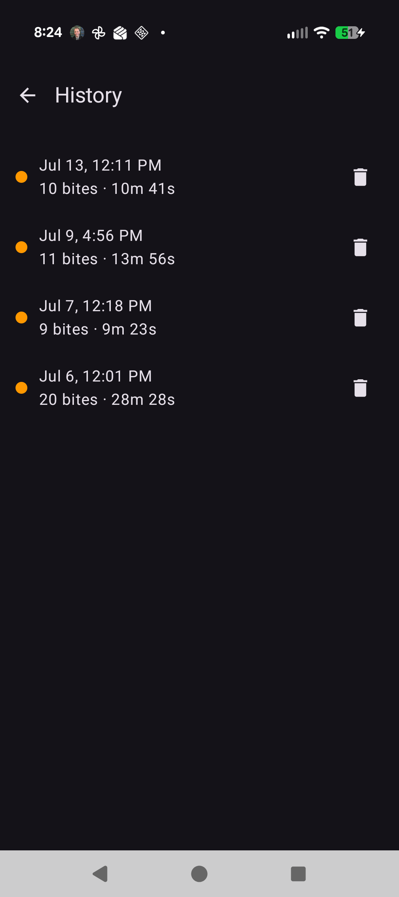

# Mindful Eating

Two apps that help you pace your meals — a **Wear OS watch app** and an **Android phone
companion app** — with settings and session history synced between them. Start a session, and
a progress ring depletes over a configurable interval (60 seconds by default). When it hits
zero, a distinct double-pulse vibration cues your next bite, the bite counter increments, and
a new countdown starts automatically — repeating until you end the session. Change a setting
or log a session on either device and it shows up on the other.

Built with Kotlin + Jetpack Compose (Wear Compose for the watch, Compose Material3 for the
phone), sharing a single non-UI `:core` module between both apps.

## Screenshots

**Watch**

<p>
  
  
  
  
  
</p>

**Phone**

<p>
  
  
  
  
  
</p>

## Features

- Perimeter/ring progress indicator that depletes over the countdown, tinted with your chosen accent color
- Distinct double-pulse vibration cue, separate from a single system buzz — reliable even with the screen off, backed by a foreground Service on both apps
- Auto-repeating cycle with a live bite counter for the current session
- Pause/resume without losing your place; long-press the button to end the session
- Settings: adjustable interval (10–180s in 5s steps), 10 preset accent colors
- Session history: date/time, bite count, and duration for each past session, with per-entry delete
- **Watch ↔ phone sync**: settings and history stay in sync across both apps via the Wearable Data Layer API — start a session on your watch, see it logged on your phone (and vice versa)
- Ambient (always-on display) support on the watch — the countdown keeps ticking and can still vibrate when the screen dims, shown as a thinner monochrome ring in low-power mode

## Project structure

- **`app/`** — the Wear OS watch app
- **`mobile/`** — the Android phone companion app
- **`core/`** — shared library module: timer/session logic, settings & history storage, and the watch↔phone sync layer, used by both apps

Both apps must share the same package name and signing key for sync to work — this is a Google
Play services requirement for the Wearable Data Layer API, not something configured per-app.

## Requirements

- Android Studio (2025.2 "Otter" or newer) with JDK 17
- Android SDK Platform 36.1 (Android 16 QPR2) and Build-Tools 36+ installed
- A Wear OS device or emulator (Wear OS 5+, minSdk 30) and/or an Android phone (minSdk 30) — either app can be built and installed independently, but sync requires both

## Building

Open the project in Android Studio and let Gradle sync, or build from the command line:

```
./gradlew assembleDebug
```

This produces both debug APKs:
- Watch: `app/build/outputs/apk/debug/app-debug.apk`
- Phone: `mobile/build/outputs/apk/debug/mobile-debug.apk`

## Installing over Wi-Fi (watch or phone)

Both devices use the same Wireless debugging flow:

1. On the device: **Settings > Developer options > Wireless debugging**, enable it, then tap
   **Pair new device** to get a pairing code and IP:port.
2. Pair once:
   ```
   adb pair <PAIRING_IP>:<PAIRING_PORT>
   ```
3. Connect to the device's debug endpoint (a separate IP:port shown once paired):
   ```
   adb connect <DEVICE_IP>:<DEBUG_PORT>
   ```
4. Install the matching APK:
   ```
   adb -s <DEVICE_IP>:<DEBUG_PORT> install -r app/build/outputs/apk/debug/app-debug.apk       # watch
   adb -s <DEVICE_IP>:<DEBUG_PORT> install -r mobile/build/outputs/apk/debug/mobile-debug.apk  # phone
   ```

A phone can also just be plugged in via USB with USB debugging enabled instead of steps 1–3.

## License

MIT — see [LICENSE](LICENSE).
